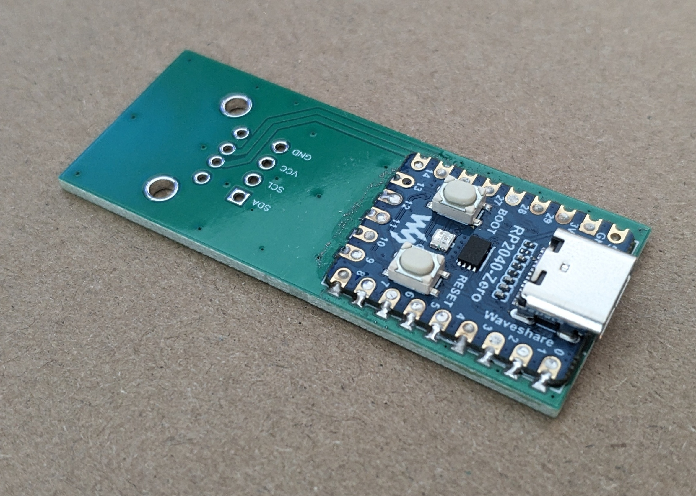
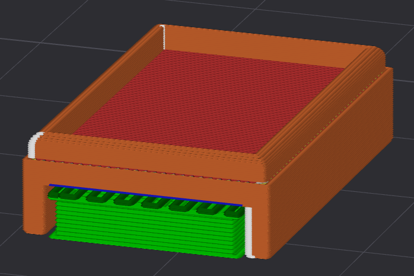
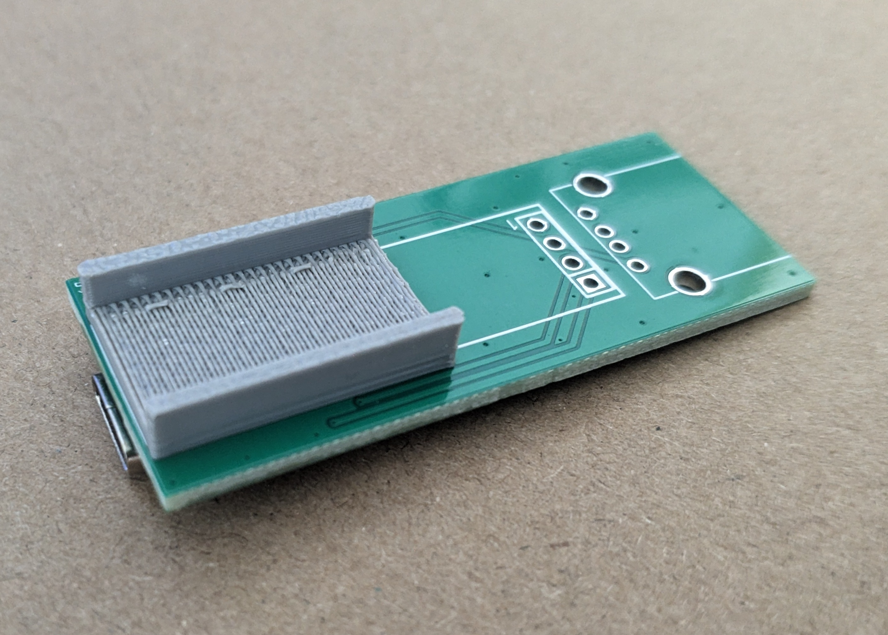
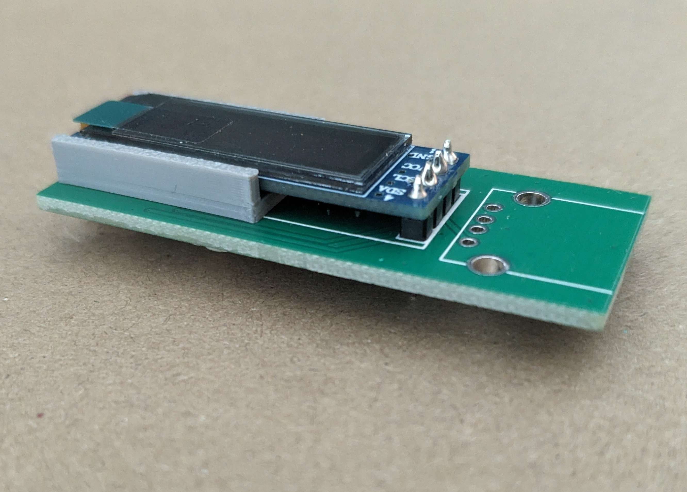
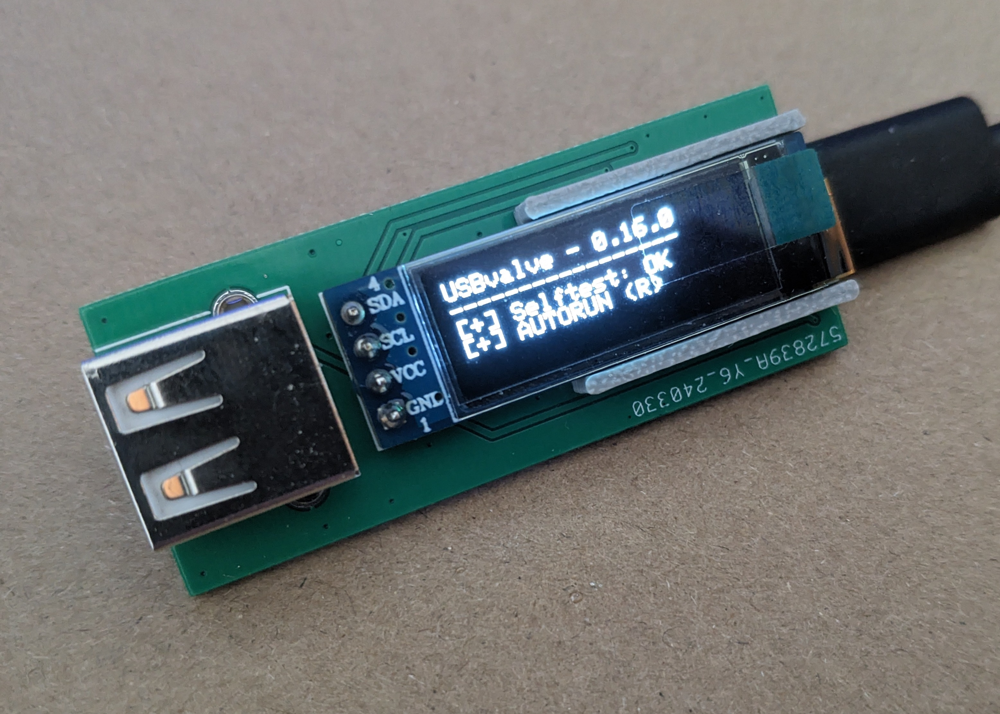

# USB Valve - Type-C

Modified from Cecio's [USBvalve-1.2_A PCB](https://github.com/cecio/USBvalve/blob/main/PCB/Gerber_USBvalve-1.2_A-PCB.zip)

This repo only contains information about the board itself, please check [USBvalve](https://github.com/cecio/USBvalve) for more information.

## BOM

| PN                                  | Vendor    | Discription                                            |
| ----------------------------------- | --------- | ------------------------------------------------------ |
| RP2040-Zero                         | Waveshare | A smaller version of the Raspberry Pi Pico with Type-C |
| HS91L02W2C01                        | HS        | 128x32 I2C OLED display                                |
| HB-PH3-25414PB2GOP                  | HANBO     | 1x4 P2.54mm pin                                        |
| USB-231-BRW                         | XUNPU     | USB A port                                             |
| [DISP-support](./DISP-support.step) |           | 3D printed part to hold the OLED module                |

## Assemble

1. Solder the RP2040-Zero to the bottom of the board

    

2. Print out the [DISP-support](./DISP-support.step)

    

3. Press fit the printed part onto the PCB

    - U side facing up
    - Might require some force

    

4. Assemble the pin and OLED module as shown in the photo, and solder them together

    - Cut the extra length if you like

    

5. Solder the USB A port to the board

6. Make sure everything is properly connected and not short with a multi-meter before powering on

1. Load the latest [release (USBvalve-*-32.uf2)](https://github.com/cecio/USBvalve/releases) to the RP2040-Zero

Now you're done! Enjoy!

